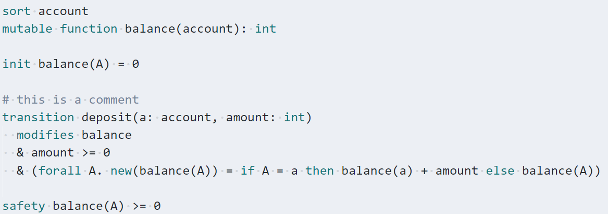

# mypyvy-syntax-highlighting README

Provides basic syntax highlighting for mypyvy source files (`.pyv` extension).
This is what the highlighting looks like:

## Release Notes

### 2021-08-13

- Initial release. Highlights keywords and comments. You can also
  comment/uncomment lines using the Ctrl + / shortcut.