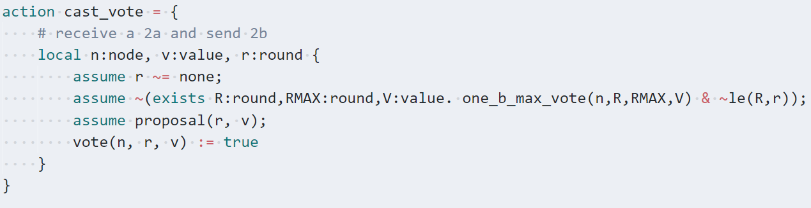

# Ivy & mypyvy Syntax Highlighting

Provides basic syntax highlighting for Ivy (`.ivy` extension) and mypyvy source
files (`.pyv` extension) in Visual Studio Code. This is what the highlighting
looks like:

Ivy:


mypyvy:


## Development

This extension was produced using https://github.com/microsoft/vscode-generator-code.

To [create a VSIX file](https://code.visualstudio.com/api/working-with-extensions/publishing-extension#packaging-extensions) that others can install in VS Code:

```
npm install -g vsce
vsce package
```

## Release Notes

### 2021-08-13

- Initial release. Highlights keywords and comments. You can also
  comment/uncomment lines using the Ctrl + / shortcut.